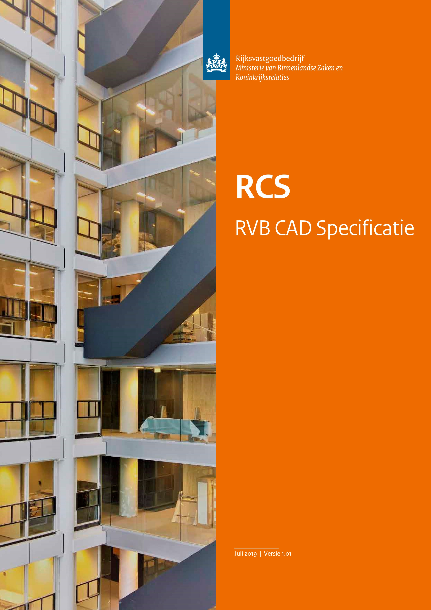
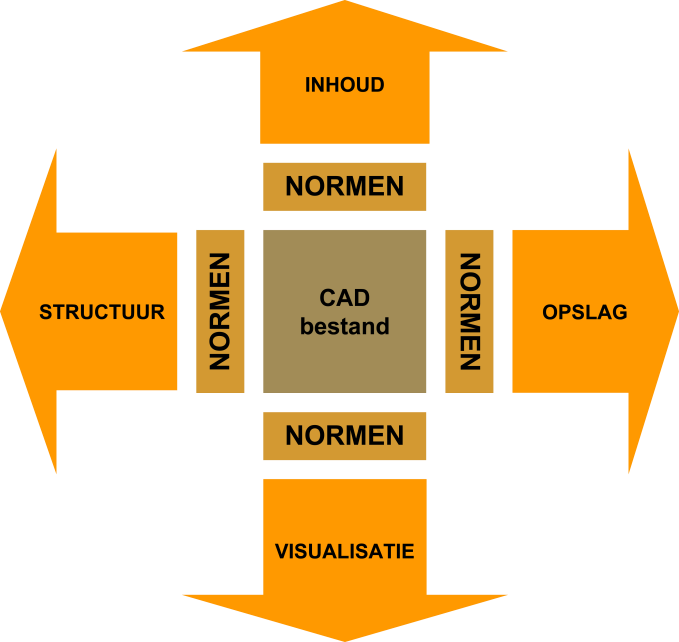

# Cover

# Voorwoord 

Het Rijksvastgoedbedrijf is de vastgoedorganisatie van en voor de
Rijksoverheid. Het

Rijksvastgoedbedrijf is verantwoordelijk voor instandhouding en beheer
van de grootste en meest diverse vastgoedportefeuille van Nederland. Het
Rijksvastgoedbedrijf treedt vanuit zijn rol veelal op als
eindopdrachtgever. Voor een adequaat beheer van de portefeuille is
actuele vastgoedinformatie noodzakelijk. Vastgoedinformatie wordt vaak
vastgelegd in tekeningen, naast andere wijzen van vastlegging. Bij
nieuwbouw, verbouw, aankoop, aanhuur en onderhoud van bouwwerken worden
tekeningen geraadpleegd en vervaardigd. Vooral tekeningen waarop de
gerealiseerde situatie ter plaatse wordt weergegeven -technisch
revisietekenwerk of 'as built'/’as is’/'as maintained' tekenwerk- zijn
voor het Rijksvastgoedbedrijf van belang. Het Rijksvastgoedbedrijf stelt
met deze CAD Specificatie[1] eisen aan dit technisch revisietekenwerk.

Het Rijksvastgoedbedrijf behoudt zich het recht voor om in concrete
gevallen aanvullende of afwijkende instructies (aanvullend of afwijkend
ten opzichte van deze Specificatie) af te geven voor vervaardiging van
technisch revisietekenwerk.

Op diverse plaatsen in deze Specificatie wordt er verwezen naar externe
normen. Als er in deze Specificatie aanvullende of afwijkende eisen
(aanvullend of afwijkend ten opzichte van deze externe normen) worden
gesteld dan gaan deze altijd vóór op het bepaalde in deze externe
normen. De eisen zijn van toepassing op alle revisietekenwerk binnen een
project en gelden voor alle disciplines. Als er voor een discipline
aanvullende en/of afwijkende eisen gesteld worden, wordt dit specifiek
aangegeven

**Leeswijzer**

Technisch
revisietekenwerk wordt geleverd in een CAD-bestand. CAD-bestanden zijn
te beschrijven in vier dimensies: structuur, inhoud, visualisatie en
opslag. Bij structuur gaat het om de samenhang, en daarmee de betekenis,
van de entiteiten aangebracht binnen een CAD-bestand. Bij inhoud gaat
het om het vastleggen van de werkelijkheid met behulp van deze
gestructureerde en betekenisvolle entiteiten. Bij visualisatie gaat het
om de vertaling van de aangebrachte inhoud en structuur in een
CAD-bestand naar een ander medium voor ter beschikkingstelling van de
informatie. Bij opslag gaat het om de opslag van een CAD-bestand. Voor
elke dimensie zijn er in deze Specificatie eisen opgesteld.

De hoofdstukken 1 tot en met 4 beschrijven de eisen voor technisch
revisietekenwerk met betrekking tot deze vier dimensies. In de bijlagen
komen achtereenvolgend definities, tekeningenlijst en normenoverzicht
aan bod.

